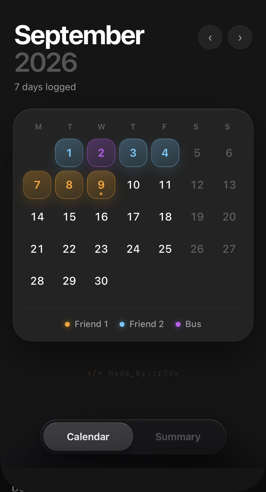
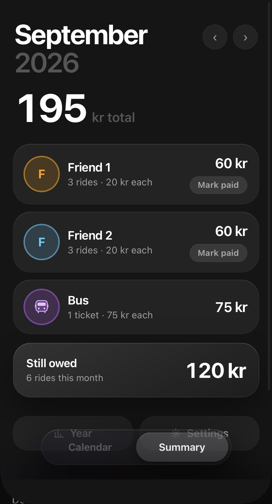

# Commute Tracker

 

A single-file web app for tracking who drove you to work, so you know exactly what you owe at the end of the month.

## Why it exists

I commute five days a week. Some days one friend drives me, some days another does, and some days neither can, so I take the bus. I pay a fixed amount per ride but settle up at the end of the month rather than day by day.

By the time the month ended I never knew how many days each of them had driven me, so I guessed, which meant either short-changing a friend or paying more than I owed. Notes apps and spreadsheets did not stick. Logging a ride has to take two seconds on a phone screen, standing outside the office, or it does not happen at all.

So the point of the app is not the arithmetic. It is that logging a day is two taps, and that it reminds you about the month you forgot.

## Using it

**Every day.** Open it from the home screen icon, tap today, pick who drove you. Tap the day again to change or clear it. If you went one way with someone and came back another, use *Split the day*.

**End of the month.** Open Summary. Each person shows their ride count and what they are owed. Pay them, hit *Mark paid*, and the amount is struck through. If you move into a new month with something still unpaid, a banner appears at the top with the breakdown.

**Occasionally.** Settings, Data, *Save backup to Files*, and save it to iCloud Drive. Once every few months is plenty.

**Almost never.** If the app ever opens empty, after a new phone or cleared Safari data, use *Restore from a file* and everything comes back.

## First launch

The app ships blank and asks who drives you. For each person set a name, a colour, and optionally a photo from your camera roll, dragging and zooming to frame it inside the circle. Set the price per ride, the bus fare and the currency. All of it is editable later under Settings.

Nothing about the people is hardcoded, which is why the source can be public while the contents stay private.

## Screens

**Calendar.** The month in large type, how many days are logged, and the grid. Marked days are filled with that person's colour, and split days are split diagonally between two of them. Tapping a day opens a bottom sheet with the options, which you can flick down to dismiss.

**Summary.** The month total, a row per person with rides and balance, a bus row, and what is still owed. Two collapsible panels sit underneath: *Year* and *Settings*, which holds people, prices and data.

**Year.** All twelve months as columns scaled to the most expensive one, each stacked by colour so you can see who the money went to, not just how much. The annual total sits above it, per-person and bus subtotals below, and the busiest month at the bottom. Tapping a column jumps the app to that month.

## Split days

Some days one person drives you in and you get home another way. *Split the day*, under the three options in the day sheet, lets you pick a morning and an afternoon separately. Each leg counts as half a ride at half the price, and the button shows what the day will cost before you save it.

Picking the same option for both halves stores it as an ordinary full day. Amounts show decimals only when a split produces them, so whole numbers stay clean.

## Where the data lives

In `localStorage`, in the browser on your device. Nothing is uploaded, nothing is shared, and no network request happens after the page loads. Photos are cropped and downscaled to 240x240 in-browser and stored alongside everything else.

Closing the tab, quitting Safari or restarting the phone does not affect it. It survives until you clear Safari's website data or change device, hence the backups.

The app requests persistent storage on launch. Safari clears script-writable storage after seven days of use without interaction with a site. Home screen web apps have their own counter and are not expected to be affected, but the request costs nothing.

Backups are plain JSON. *Save backup to Files* opens the iOS share sheet so you can drop it in iCloud Drive, with *Copy as text* and *Paste text to restore* as fallbacks. The date of the last backup is shown in Settings and turns amber once it is over two months old.

## Install on iOS

1. Open the hosted URL in Safari.
2. Share, then Add to Home Screen.
3. Launch it from the icon. Fullscreen, no browser chrome, works offline.

Always open it from that icon. Data does not follow you between Safari and Chrome, and a home screen app is exempt from Safari's seven-day storage cap.

Drop a 180x180 `icon.png` next to `index.html` for a custom home screen icon.

## How it is built

Vanilla JavaScript, no dependencies, no build tooling, around 1,050 lines in one file including the CSS.

- Persistence through `localStorage`, with detection for contexts that block it.
- A day is stored either as a single value or as a `{am, pm}` pair, and everything downstream reads it through one function that flattens both into weighted legs. Splits therefore needed no change to storage, totals or backups.
- Image handling with `FileReader` and `canvas`, resized client-side to stay well under the storage quota.
- Dialogs are built in-app rather than using `confirm()` and `prompt()`, which are blocked in standalone and embedded contexts.
- Backup export uses the Web Share API with a file when available, falling back to a download link.
- Entrance animations only play when the content genuinely changes, such as switching month or tab. In-place updates like marking someone paid redraw silently, so a single tap never replays the whole screen.
- Dark mode only, system font, tabular figures so numbers do not shift between months. Reduced-motion preferences are respected.

## Hosting

Any static host. For GitHub Pages, keep `index.html` at the repository root and deploy from `main` under Settings, Pages.